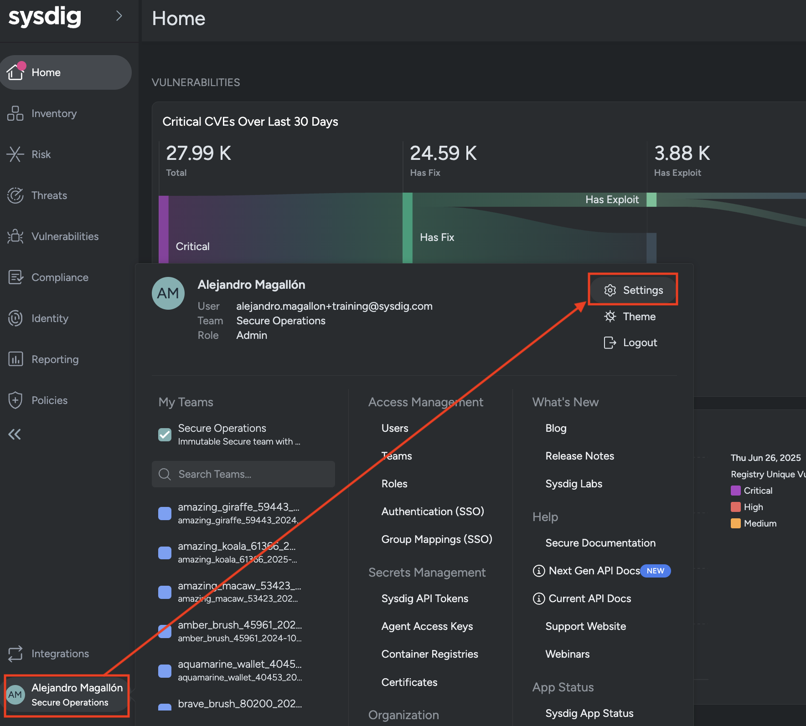
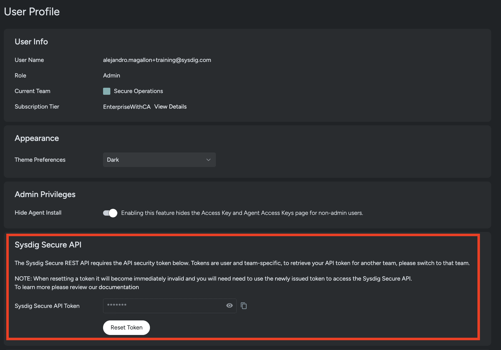
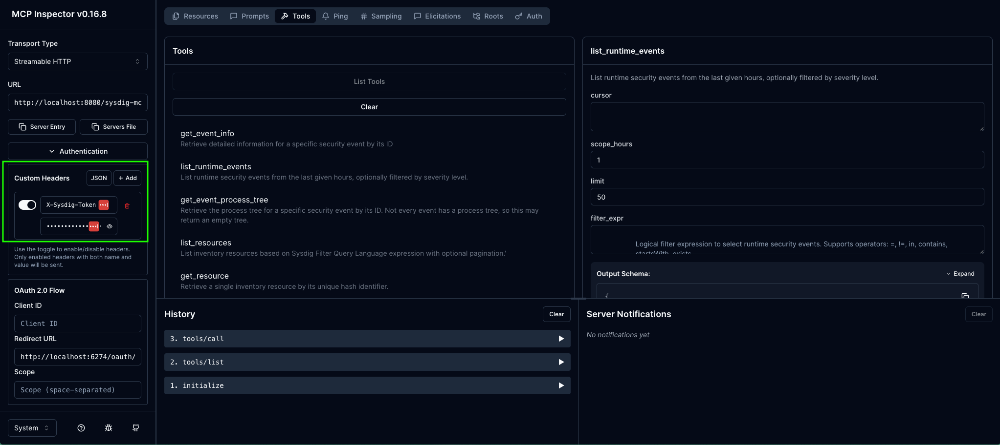
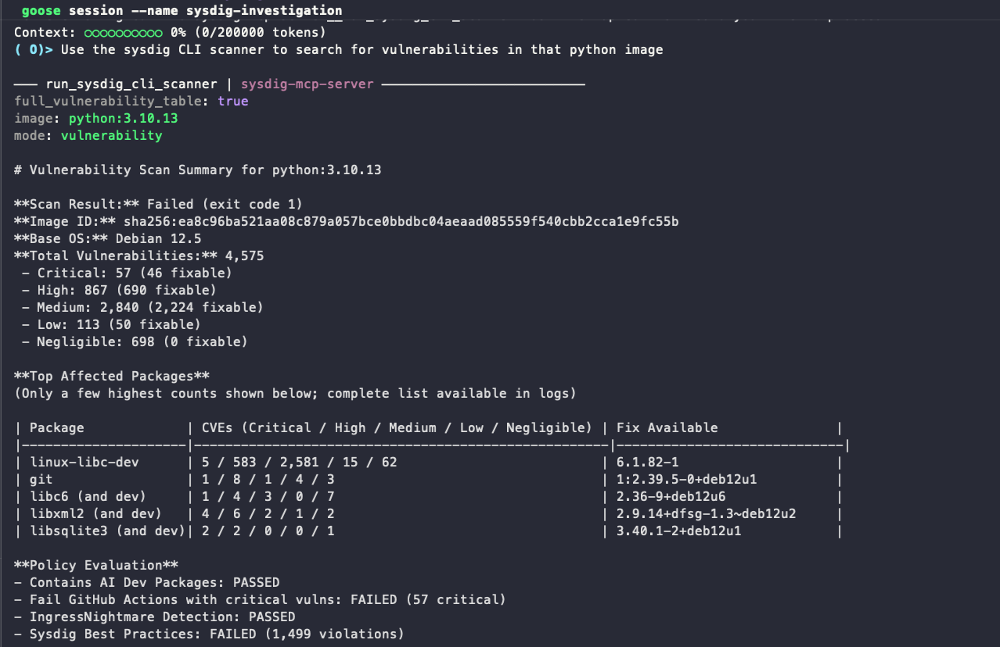

# Sysdig MCP Server

[](https://github.com/sysdiglabs/sysdig-mcp-server/actions/workflows/publish.yaml)

---

## Table of contents

- [Sysdig MCP Server](#sysdig-mcp-server)
  - [Table of contents](#table-of-contents)
  - [Description](#description)
  - [Quickstart Guide](#quickstart-guide)
  - [Available Tools](#available-tools)
  - [Requirements](#requirements)
  - [Configuration](#configuration)
    - [API Permissions](#api-permissions)
  - [Server Setup](#server-setup)
    - [Go](#go)
    - [Docker](#docker)
    - [Binary](#binary)
    - [Kubernetes](#kubernetes)
  - [Client Configuration](#client-configuration)
    - [Authentication](#authentication)
    - [URL](#url)
    - [Claude Desktop App](#claude-desktop-app)
    - [MCP Inspector](#mcp-inspector)
    - [Goose Agent](#goose-agent)

## Description

This is an implementation of an [MCP (Model Context Protocol) Server](https://modelcontextprotocol.io/quickstart/server) to allow different LLMs to query information from the Sysdig platform (Monitor and Secure). New tools and functionalities will be added over time following semantic versioning. The goal is to provide a simple and easy-to-use interface for querying information from the Sysdig platform using LLMs.

## Quickstart Guide

Get up and running with the Sysdig MCP Server quickly using our pre-built Docker image.

1. **Get your API Token**:
    Go to your Sysdig Secure instance and navigate to **Settings > Sysdig Secure API**. Here, you can generate or copy your API token. This token is required to authenticate requests to the Sysdig Platform (See the [Configuration](#configuration) section for more details).

2. **Configure your MCP client**:

    Add the following configuration to your MCP client (e.g., Claude Desktop's `claude_desktop_config.json`). The client will automatically pull the Docker image and start the server. You can apply this configuration to any other client that supports MCP (For more details, see the [Client Configuration](#client-configuration) section).

    Substitute the following placeholders with your actual values:
    - `<your_sysdig_host>`: The hostname of your Sysdig Secure instance (e.g., `https://us2.app.sysdig.com` or `https://eu1.app.sysdig.com`)
    - `<your_sysdig_secure_api_token>`: Your Sysdig Secure API token

    ```json
    {
      "mcpServers": {
        "sysdig-mcp-server": {
          "command": "docker",
          "args": [
            "run",
            "-i",
            "--rm",
            "-e",
            "SYSDIG_MCP_API_HOST",
            "-e",
            "SYSDIG_MCP_TRANSPORT",
            "-e",
            "SYSDIG_MCP_API_TOKEN",
            "ghcr.io/sysdiglabs/sysdig-mcp-server:latest"
          ],
          "env": {
            "SYSDIG_MCP_API_HOST": "<your_sysdig_host>",
            "SYSDIG_MCP_API_TOKEN": "<your_sysdig_secure_api_token>",
            "SYSDIG_MCP_TRANSPORT": "stdio"
          }
        }
      }
    }
    ```

## Available Tools

The server dynamically filters the available tools based on the permissions associated with the API token used for the request. If the token lacks the required permissions for a tool, that tool will not be listed.

### Sysdig Monitor

- **`k8s_list_clusters`**
  - **Description**: Lists the cluster information for all clusters or just the cluster specified.
  - **Required Permission**: `metrics-data.read`
  - **Sample Prompt**: "List all kubernetes clusters" or "Show me info for cluster 'production-gke'"

- **`k8s_list_nodes`**
  - **Description**: Lists the node information for all nodes, all nodes from a cluster or just the node specified.
  - **Required Permission**: `metrics-data.read`
  - **Sample Prompt**: "List all kubernetes nodes in the cluster 'production-gke'" or "Show me info for node 'node-123'"

- **`k8s_list_workloads`**
  - **Description**: Lists all the workloads that are in a particular state, desired, ready, running or unavailable. The LLM can filter by cluster, namespace, workload name or type.
  - **Required Permission**: `metrics-data.read`
  - **Sample Prompt**: "List all desired workloads in the cluster 'production-gke' and namespace 'default'"

- **`k8s_list_pod_containers`**
  - **Description**: Retrieves information from a particular pod and container.
  - **Required Permission**: `metrics-data.read`
  - **Sample Prompt**: "Show me info for pod 'my-pod' in cluster 'production-gke'"

- **`k8s_list_cronjobs`**
  - **Description**: Retrieves information from the cronjobs in the cluster.
  - **Required Permission**: `metrics-data.read`
  - **Sample Prompt**: "List all cronjobs in cluster 'prod' and namespace 'default'"

- **`k8s_list_count_pods_per_cluster`**
  - **Description**: List the count of running Kubernetes Pods grouped by cluster and namespace.
  - **Required Permission**: `metrics-data.read`
  - **Sample Prompt**: "List the count of running Kubernetes Pods in cluster 'production'"

- **`k8s_list_top_unavailable_pods`**
  - **Description**: Shows the top N pods with the highest number of unavailable or unready replicas in a Kubernetes cluster, ordered from highest to lowest.
  - **Required Permission**: `metrics-data.read`
  - **Sample Prompt**: "Show the top 20 unavailable pods in cluster 'production'"

- **`k8s_list_top_restarted_pods`**
  - **Description**: Lists the pods with the highest number of container restarts in the specified scope (cluster, namespace, workload, or individual pod). By default, it returns the top 10.
  - **Required Permission**: `metrics-data.read`
  - **Sample Prompt**: "Show the top 10 pods with the most container restarts in cluster 'production'"

- **`k8s_list_top_http_errors_in_pods`**
  - **Description**: Lists the pods with the highest rate of HTTP 4xx and 5xx errors over a specified time interval, allowing filtering by cluster, namespace, workload type, and workload name.
  - **Required Permission**: `metrics-data.read`
  - **Sample Prompt**: "Show the top 20 pods with the most HTTP errors in cluster 'production'"

- **`k8s_list_top_network_errors_in_pods`**
  - **Description**: Shows the top network errors by pod over a given interval, aggregated by cluster, namespace, workload type, and workload name. The result is an average rate of network errors per second.
  - **Required Permission**: `metrics-data.read`
  - **Sample Prompt**: "Show the top 10 pods with the most network errors in cluster 'production'"

- **`k8s_list_top_cpu_consumed_workload`**
  - **Description**: Identifies the Kubernetes workloads (all containers) consuming the most CPU (in cores).
  - **Required Permission**: `metrics-data.read`
  - **Sample Prompt**: "Show the top 10 workloads consuming the most CPU in cluster 'production'"

- **`k8s_list_top_cpu_consumed_container`**
  - **Description**: Identifies the Kubernetes containers consuming the most CPU (in cores).
  - **Required Permission**: `metrics-data.read`
  - **Sample Prompt**: "Show the top 10 containers consuming the most CPU in cluster 'production'"

- **`k8s_list_top_memory_consumed_workload`**
  - **Description**: Lists memory-intensive workloads (all containers).
  - **Required Permission**: `metrics-data.read`
  - **Sample Prompt**: "Show the top 10 workloads consuming the most memory in cluster 'production'"

- **`k8s_list_top_memory_consumed_container`**
  - **Description**: Lists memory-intensive containers.
  - **Required Permission**: `metrics-data.read`
  - **Sample Prompt**: "Show the top 10 containers consuming the most memory in cluster 'production'"

- **`k8s_list_underutilized_pods_cpu_quota`**
  - **Description**: List Kubernetes pods with CPU usage below 25% of the quota limit.
  - **Required Permission**: `metrics-data.read`
  - **Sample Prompt**: "Show the top 10 underutilized pods by CPU quota in cluster 'production'"

- **`k8s_list_underutilized_pods_memory_quota`**
  - **Description**: List Kubernetes pods with memory usage below 25% of the limit.
  - **Required Permission**: `metrics-data.read`
  - **Sample Prompt**: "Show the top 10 underutilized pods by memory quota in cluster 'production'"

### Sysdig Secure

- **`list_runtime_events`**
  - **Description**: List runtime security events from the last given hours, optionally filtered by severity level.
  - **Required Permission**: `policy-events.read`
  - **Sample Prompt**: "Show me high severity events from the last 2 hours in cluster1"

- **`get_event_info`**
  - **Description**: Retrieve detailed information for a specific security event by its ID.
  - **Required Permission**: `policy-events.read`
  - **Sample Prompt**: "Get full details for event ID 123abc"

- **`get_event_process_tree`**
  - **Description**: Retrieve the process tree for a specific event (if available).
  - **Required Permission**: `policy-events.read`
  - **Sample Prompt**: "Get the process tree for event ID abc123"

- **`run_sysql`**
  - **Description**: Execute a pre-written SysQL query directly (use only when user provides explicit query).
  - **Required Permission**: `sage.exec`, `risks.read`
  - **Sample Prompt**: "Run this query: MATCH CloudResource WHERE type = 'aws_s3_bucket' LIMIT 10"

### Sysdig Monitor & Sysdig Secure

- **`generate_sysql`**
  - **Description**: Generates a SysQL query from a natural language question.
  - **Required Permission**: `sage.exec`
  - **Sample Prompt**: "List top 10 pods by memory usage in the last hour"
  - **Note**: The `generate_sysql` tool currently does not work with Service Account tokens and will return a 500 error. For this tool, use an API token assigned to a regular user account.

## Requirements
- [Go](https://go.dev/doc/install) 1.26 or higher (if running without Docker).

## Configuration

The following environment variables are **required** for configuring the Sysdig SDK:

- `SYSDIG_MCP_API_HOST`: The URL of your Sysdig Secure instance (e.g., `https://us2.app.sysdig.com`). **Required when using `stdio` transport.**
- `SYSDIG_MCP_API_TOKEN`: Your Sysdig Secure API token. **Required only when using `stdio` transport.**

You can also set the following variables to override the default configuration:

- `SYSDIG_MCP_TRANSPORT`: The transport protocol for the MCP Server (`stdio`, `streamable-http`, `sse`). Defaults to: `stdio`.
- `SYSDIG_MCP_API_SKIP_TLS_VERIFICATION`: Whether to skip TLS verification for the Sysdig API connection (useful for self-signed certificates). Defaults to: `false`.
- `SYSDIG_MCP_MOUNT_PATH`:  The URL prefix for the streamable-http/sse deployment. Defaults to: `/sysdig-mcp-server`
- `SYSDIG_MCP_LOGLEVEL`: Log Level of the application (`DEBUG`, `INFO`, `WARNING`, `ERROR`). Defaults to: `INFO`
- `SYSDIG_MCP_LISTENING_PORT`: The port for the server when it is deployed using remote protocols (`streamable-http`, `sse`). Defaults to: `8080`
- `SYSDIG_MCP_LISTENING_HOST`: The host for the server when it is deployed using remote protocols (`streamable-http`, `sse`). Defaults to all interfaces (`:port`). Set to `127.0.0.1` for local-only access.
- `SYSDIG_MCP_STATELESS`: Enable stateless mode for `streamable-http` transport, where each request is self-contained with no session tracking (useful for AWS Bedrock AgentCore). Defaults to: `false`.

You can find your API token in the Sysdig Secure UI under **Settings > Sysdig Secure API**. Make sure to copy the token as it will not be shown again.





**Example configuration (stdio):**

```bash
# Required
SYSDIG_MCP_API_HOST=<your_sysdig_host>
SYSDIG_MCP_API_TOKEN=your-api-token-here

# Optional
SYSDIG_MCP_TRANSPORT=stdio
SYSDIG_MCP_LOGLEVEL=INFO
```

**Example configuration (streamable-http / sse):**

```bash
# Required
SYSDIG_MCP_TRANSPORT=streamable-http

# Optional (Host and Token can be provided via HTTP headers)
# SYSDIG_MCP_API_HOST=<your_sysdig_host>
# SYSDIG_MCP_API_TOKEN=your-api-token-here
SYSDIG_MCP_LISTENING_PORT=8080
SYSDIG_MCP_LISTENING_HOST=
SYSDIG_MCP_MOUNT_PATH=/sysdig-mcp-server
```

### API Permissions

To use the MCP server tools, your API token needs specific permissions in Sysdig Secure. We recommend creating a dedicated Service Account (SA) with a custom role containing only the required permissions.

**Permissions Mapping:**

| Permission           | Sysdig UI Permission Name                   |
|----------------------|---------------------------------------------|
| `metrics-data.read`  | Data Access Settings: "Metrics Data" (Read) |
| `policy-events.read` | Threats: "Policy Events" (Read)             |
| `risks.read`         | Risks: "Access to risk feature" (Read)      |
| `sage.exec`          | SysQL: "AI Query Generation" (Exec)         |

**Additional Permissions:**

- Settings: "API Access Token" - View, Read, Edit (required to generate and manage API tokens)

**Setting up Permissions:**

1. Go to **Settings > Users & Teams > Roles** in your Sysdig Secure instance
2. Create a new role with the permissions listed above
3. Assign this role to a Service Account or user
4. Use the API token from that account with the MCP server

> **Note:** When selecting permissions, some dependent permissions may be automatically added by Sysdig.

For detailed instructions, see the official [Sysdig Roles Administration documentation](https://docs.sysdig.com/en/administration/roles-administration/).

>[!IMPORTANT]
> **Service Account Limitation:** The `generate_sysql` tool currently does not work with Service Account tokens and will return a 500 error. For this tool, use an API token assigned to a regular user account.


## Server Setup

The MCP server is never invoked manually. Depending on the transport protocol, the MCP client either starts the server process automatically or connects to a running service:

- **Local (`stdio`)**: The MCP client (e.g., Claude Desktop, Cursor) spawns the server process based on your [client configuration](#client-configuration). You only need the server available on your system via Go, Docker, or a pre-built binary.
- **Remote (`streamable-http`, `sse`)**: The server is deployed as a service (e.g., Docker Compose, Kubernetes) and the MCP client connects to it via URL.

### Go

If you have Go installed, the MCP client can run the server directly without cloning the repository. Configure your client with:

```json
{
  "mcpServers": {
    "sysdig-mcp-server": {
      "command": "go",
      "args": [
        "run",
        "github.com/sysdiglabs/sysdig-mcp-server/cmd/server@latest"
      ],
      "env": {
        "SYSDIG_MCP_API_HOST": "<your_sysdig_host>",
        "SYSDIG_MCP_API_TOKEN": "<your_sysdig_secure_api_token>",
        "SYSDIG_MCP_TRANSPORT": "stdio"
      }
    }
  }
}
```

Or using the CLI:

```bash
# Claude Code
claude mcp add --transport stdio \
  -e SYSDIG_MCP_API_HOST=<your_sysdig_host> \
  -e SYSDIG_MCP_API_TOKEN=<your_sysdig_secure_api_token> \
  -e SYSDIG_MCP_TRANSPORT=stdio \
  -- sysdig-mcp-server go run github.com/sysdiglabs/sysdig-mcp-server/cmd/server@latest

# Gemini CLI
gemini mcp add -t stdio \
  -e SYSDIG_MCP_API_HOST=<your_sysdig_host> \
  -e SYSDIG_MCP_API_TOKEN=<your_sysdig_secure_api_token> \
  -e SYSDIG_MCP_TRANSPORT=stdio \
  sysdig-mcp-server go run github.com/sysdiglabs/sysdig-mcp-server/cmd/server@latest

# Codex CLI
codex mcp add \
  --env SYSDIG_MCP_API_HOST=<your_sysdig_host> \
  --env SYSDIG_MCP_API_TOKEN=<your_sysdig_secure_api_token> \
  --env SYSDIG_MCP_TRANSPORT=stdio \
  -- sysdig-mcp-server go run github.com/sysdiglabs/sysdig-mcp-server/cmd/server@latest
```

### Docker

The pre-built Docker image is available from the GitHub Container Registry:

```bash
docker pull ghcr.io/sysdiglabs/sysdig-mcp-server:latest
```

Configure your client with:

```json
{
  "mcpServers": {
    "sysdig-mcp-server": {
      "command": "docker",
      "args": [
        "run",
        "-i",
        "--rm",
        "-e",
        "SYSDIG_MCP_API_HOST",
        "-e",
        "SYSDIG_MCP_TRANSPORT",
        "-e",
        "SYSDIG_MCP_API_TOKEN",
        "ghcr.io/sysdiglabs/sysdig-mcp-server:latest"
      ],
      "env": {
        "SYSDIG_MCP_API_HOST": "<your_sysdig_host>",
        "SYSDIG_MCP_API_TOKEN": "<your_sysdig_secure_api_token>",
        "SYSDIG_MCP_TRANSPORT": "stdio"
      }
    }
  }
}
```

For remote transports, deploy the container as a service with the appropriate environment variables (see [Configuration](#configuration)).

### Binary

Download the latest pre-built binary for your platform from [GitHub Releases](https://github.com/sysdiglabs/sysdig-mcp-server/releases/latest), extract it, and place it somewhere in your `PATH` (e.g., `/usr/local/bin`):

```bash
# macOS (Apple Silicon)
curl -L https://github.com/sysdiglabs/sysdig-mcp-server/releases/latest/download/sysdig-mcp-server_darwin-arm64.tar.gz | tar xz

# macOS (Intel)
curl -L https://github.com/sysdiglabs/sysdig-mcp-server/releases/latest/download/sysdig-mcp-server_darwin-amd64.tar.gz | tar xz

# Linux (x86_64)
curl -L https://github.com/sysdiglabs/sysdig-mcp-server/releases/latest/download/sysdig-mcp-server_linux-amd64.tar.gz | tar xz

# Linux (arm64)
curl -L https://github.com/sysdiglabs/sysdig-mcp-server/releases/latest/download/sysdig-mcp-server_linux-arm64.tar.gz | tar xz
```

Windows `.zip` archives are also available on the [releases page](https://github.com/sysdiglabs/sysdig-mcp-server/releases/latest).

Configure your client with:

```json
{
  "mcpServers": {
    "sysdig-mcp-server": {
      "command": "sysdig-mcp-server",
      "env": {
        "SYSDIG_MCP_API_HOST": "<your_sysdig_host>",
        "SYSDIG_MCP_API_TOKEN": "<your_sysdig_secure_api_token>",
        "SYSDIG_MCP_TRANSPORT": "stdio"
      }
    }
  }
}
```

Or using the CLI:

```bash
# Claude Code
claude mcp add --transport stdio \
  -e SYSDIG_MCP_API_HOST=<your_sysdig_host> \
  -e SYSDIG_MCP_API_TOKEN=<your_sysdig_secure_api_token> \
  -e SYSDIG_MCP_TRANSPORT=stdio \
  -- sysdig-mcp-server sysdig-mcp-server

# Gemini CLI
gemini mcp add -t stdio \
  -e SYSDIG_MCP_API_HOST=<your_sysdig_host> \
  -e SYSDIG_MCP_API_TOKEN=<your_sysdig_secure_api_token> \
  -e SYSDIG_MCP_TRANSPORT=stdio \
  sysdig-mcp-server sysdig-mcp-server

# Codex CLI
codex mcp add \
  --env SYSDIG_MCP_API_HOST=<your_sysdig_host> \
  --env SYSDIG_MCP_API_TOKEN=<your_sysdig_secure_api_token> \
  --env SYSDIG_MCP_TRANSPORT=stdio \
  -- sysdig-mcp-server sysdig-mcp-server
```

### Kubernetes

Deploy the MCP server to a Kubernetes cluster as a remote service. MCP clients like Claude Desktop will connect to it via URL.

**1. Create a Secret with your Sysdig credentials:**

```bash
kubectl create namespace mcp-server

kubectl create secret generic mcp-server-secrets \
  --namespace mcp-server \
  --from-literal=SYSDIG_MCP_API_HOST=<your_sysdig_host> \
  --from-literal=SYSDIG_MCP_API_TOKEN=<your_sysdig_secure_api_token>
```

**2. Deploy the server:**

```yaml
apiVersion: apps/v1
kind: Deployment
metadata:
  name: mcp-server
  namespace: mcp-server
  labels:
    app: mcp-server
spec:
  replicas: 1
  selector:
    matchLabels:
      app: mcp-server
  template:
    metadata:
      labels:
        app: mcp-server
    spec:
      containers:
      - name: mcp-server
        image: ghcr.io/sysdiglabs/sysdig-mcp-server:latest
        ports:
          - containerPort: 8080
            protocol: TCP
        env:
          - name: SYSDIG_MCP_TRANSPORT
            value: "streamable-http"
        envFrom:
        - secretRef:
            name: mcp-server-secrets
---
apiVersion: v1
kind: Service
metadata:
  name: mcp-server
  namespace: mcp-server
spec:
  type: ClusterIP
  selector:
    app: mcp-server
  ports:
  - port: 8080
    targetPort: 8080
```

> **Note:** Expose the Service externally using a `NodePort`, `LoadBalancer`, or `Ingress` depending on your cluster setup. The examples in the [Client Configuration](#client-configuration) section assume the server is reachable at `http://<server-address>:<port>/sysdig-mcp-server`.

## Local Development

For local development, we provide a `flake.nix` file that sets up a reproducible environment with all necessary dependencies (Go, development tools, linters, etc.).

If you have [Nix](https://nixos.org/) installed, you can enter the development shell:

```bash
nix develop
```

If you use [direnv](https://direnv.net/), simply run:

```bash
direnv allow
```

## Client Configuration

To use the MCP server with a client like Claude or Cursor, you need to provide the server's URL and authentication details.

### Authentication

When using the `sse` or `streamable-http` transport, the server requires a Bearer token for authentication. The token is passed in the `X-Sysdig-Token` or default to `Authorization` header of the HTTP request (i.e `Bearer SYSDIG_SECURE_API_TOKEN`).

Additionally, you can specify the Sysdig Secure host by providing the `X-Sysdig-Host` header.

> **Note:** When provided, the authentication headers (`Authorization`, `X-Sysdig-Token`) and host header (`X-Sysdig-Host`) take precedence over the configured environment variables.

Example headers:

```
Authorization: Bearer <your_sysdig_secure_api_token>
X-Sysdig-Host: <your_sysdig_host>
```

### URL

If you are running the server with the `sse` or `streamable-http` transport, the URL will be `http://<host>:<port><mount_path>`, where `<mount_path>` is the value of `SYSDIG_MCP_MOUNT_PATH` (defaults to `/sysdig-mcp-server`). Do not include a trailing `/`.

For example, if you are running the server locally on port 8080 with the default mount path, the URL will be `http://localhost:8080/sysdig-mcp-server`.

### Claude Desktop App

For the Claude Desktop app, configure the MCP server by editing the `claude_desktop_config.json` file:

1. Go to **Settings > Developer** in the Claude Desktop app.
2. Click on **Edit Config** to open the `claude_desktop_config.json` file.
3. Add the JSON configuration from the [Server Setup](#server-setup) section that matches your installation method (Go, Docker, or Binary).
4. Replace `<your_sysdig_host>` with your Sysdig Secure host URL and `<your_sysdig_secure_api_token>` with your API token.
5. Save the file and restart the Claude Desktop app.

**Connecting to a Remote Server:**

If the MCP server is deployed remotely (e.g., in a [Kubernetes cluster](#kubernetes)), you can connect to it using [`mcp-remote`](https://www.npmjs.com/package/mcp-remote). This requires [Node.js](https://nodejs.org/) (v18+) installed on your machine.

```json
{
  "mcpServers": {
    "sysdig-mcp-server": {
      "command": "npx",
      "args": [
        "-y",
        "mcp-remote",
        "http://<server-address>:<port>/sysdig-mcp-server",
        "--allow-http"
      ]
    }
  }
}
```

> **Note:** The `--allow-http` flag is required when connecting over plain HTTP. If your server is behind HTTPS (e.g., via an Ingress with TLS), you can omit it. No authentication headers or tokens are needed in the client configuration when the server has `SYSDIG_MCP_API_HOST` and `SYSDIG_MCP_API_TOKEN` set as environment variables.

### MCP Inspector

1. Run the [MCP Inspector](https://modelcontextprotocol.io/docs/tools/inspector) locally.
2. Select the transport type and configure the connection to the Sysdig MCP server.
3. Pass the Authorization header if using `streamable-http` or the `SYSDIG_SECURE_API_TOKEN` env var if using `stdio`.




### Goose Agent

1. In your terminal run `goose configure` and follow the steps to add the extension (more info on the [goose docs](https://block.github.io/goose/docs/getting-started/using-extensions/)).
2. Your `~/.config/goose/config.yaml` config file should have one config like this one, check out the env vars.

  **Using Go:**

  ```yaml
  extensions:
  ...
    sysdig-mcp-server:
      args: ["run", "github.com/sysdiglabs/sysdig-mcp-server/cmd/server@latest"]
      bundled: null
      cmd: go
      description: Sysdig MCP server
      enabled: true
      env_keys:
      - SYSDIG_MCP_TRANSPORT
      - SYSDIG_MCP_API_HOST
      - SYSDIG_MCP_API_TOKEN
      envs:
        SYSDIG_MCP_TRANSPORT: stdio
      name: sysdig-mcp-server
      timeout: 300
      type: stdio
  ```
3. Have fun


