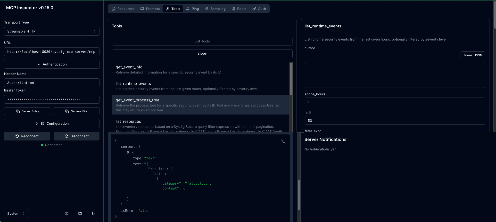

# Sysdig MCP Server

[](https://github.com/sysdiglabs/sysdig-mcp-server/actions/workflows/publish.yaml)

---

## Table of contents

- [MCP Server](#mcp-server)
  - [Table of contents](#table-of-contents)
  - [Description](#description)
  - [Quickstart Guide](#quickstart-guide)
  - [Available Tools](#available-tools)
  - [Requirements](#requirements)
  - [Configuration](#configuration)
    - [API Permissions](#api-permissions)
  - [Running the Server](#running-the-server)
    - [Docker (Recommended)](#docker-recommended)
    - [Go](#go)
  - [Client Configuration](#client-configuration)
    - [Authentication](#authentication)
    - [URL](#url)
    - [Claude Desktop App](#claude-desktop-app)
    - [MCP Inspector](#mcp-inspector)
    - [Goose Agent](#goose-agent)

## Description

This is an implementation of an [MCP (Model Context Protocol) Server](https://modelcontextprotocol.io/quickstart/server) to allow different LLMs to query information from Sysdig Secure platform. **It is still in early development and not yet ready for production use.** New endpoints and functionalities will be added over time. The goal is to provide a simple and easy-to-use interface for querying information from Sysdig Secure platform using LLMs.

## Quickstart Guide

Get up and running with the Sysdig MCP Server quickly using our pre-built Docker image.

1. **Get your API Token**:
    Go to your Sysdig Secure instance and navigate to **Settings > Sysdig Secure API**. Here, you can generate or copy your API token. This token is required to authenticate requests to the Sysdig Platform (See the [Configuration](#configuration) section for more details).

2. **Pull the image**:

    Pull the latest Sysdig MCP Server image from the GitHub Container Registry:

    ```bash
    docker pull ghcr.io/sysdiglabs/sysdig-mcp-server:latest
    ```

3. **Configure your client**:

    For example, you can configure Claude Desktop app to use the Sysdig MCP Server by editing the `claude_desktop_config.json` file. This is useful for running the server locally with the `stdio` transport. You can apply this configuration to any other client that supports MCP (For more details, see the [Client Configuration](#client-configuration) section).

    Substitute the following placeholders with your actual values:
    - `<your_sysdig_host>`: The hostname of your Sysdig Secure instance (e.g., `https://us2.app.sysdig.com` or `https://eu1.app.sysdig.com`)
    - `<your_sysdig_secure_api_token>`: Your Sysdig Secure API token

    ```json
      {
        "mcpServers": {
          "sysdig-mcp-server": {
            "command": "docker",
            "args": [
              "run",
                "-i",
                "--rm",
                "-e",
                "SYSDIG_MCP_API_HOST",
                "-e",
                "SYSDIG_MCP_TRANSPORT",
                "-e",
                "SYSDIG_MCP_API_TOKEN",
                "ghcr.io/sysdiglabs/sysdig-mcp-server:latest"
            ],
            "env": {
              "SYSDIG_MCP_API_HOST": "<your_sysdig_host>",
              "SYSDIG_MCP_API_TOKEN": "<your_sysdig_secure_api_token>",
              "SYSDIG_MCP_TRANSPORT": "stdio"
            }
          }
        }
      }
      ```

## Available Tools

The server dynamically filters the available tools based on the permissions associated with the API token used for the request. If the token lacks the required permissions for a tool, that tool will not be listed.

- **`get_event_info`**
  - **Description**: Retrieve detailed information for a specific security event by its ID.
  - **Required Permission**: `policy-events.read`
  - **Sample Prompt**: "Get full details for event ID 123abc"

- **`list_runtime_events`**
  - **Description**: List runtime security events from the last given hours, optionally filtered by severity level.
  - **Required Permission**: `policy-events.read`
  - **Sample Prompt**: "Show me high severity events from the last 2 hours in cluster1"

- **`get_event_process_tree`**
  - **Description**: Retrieve the process tree for a specific event (if available).
  - **Required Permission**: `policy-events.read`
  - **Sample Prompt**: "Get the process tree for event ID abc123"

- **`generate_sysql`**
  - **Description**: Generates a SysQL query from a natural language question.
  - **Required Permission**: `sage.exec`
  - **Sample Prompt**: "List top 10 pods by memory usage in the last hour"
  - **Note**: The `generate_sysql` tool currently does not work with Service Account tokens and will return a 500 error. For this tool, use an API token assigned to a regular user account.

- **`run_sysql`**
  - **Description**: Execute a pre-written SysQL query directly (use only when user provides explicit query).
  - **Required Permission**: `sage.exec`, `risks.read`
  - **Sample Prompt**: "Run this query: MATCH CloudResource WHERE type = 'aws_s3_bucket' LIMIT 10"

- **`kubernetes_list_clusters`**
  - **Description**: Lists the cluster information for all clusters or just the cluster specified.
  - **Required Permission**: `promql.exec`
  - **Sample Prompt**: "List all kubernetes clusters" or "Show me info for cluster 'production-gke'"

- **`kubernetes_list_nodes`**
  - **Description**: Lists the node information for all nodes, all nodes from a cluster or just the node specified.
  - **Required Permission**: `promql.exec`
  - **Sample Prompt**: "List all kubernetes nodes in the cluster 'production-gke'" or "Show me info for node 'node-123'"

- **`kubernetes_list_workloads`**
  - **Description**: Lists all the workloads that are in a particular state, desired, ready, running or unavailable. The LLM can filter by cluster, namespace, workload name or type.
  - **Required Permission**: `promql.exec`
  - **Sample Prompt**: "List all desired workloads in the cluster 'production-gke' and namespace 'default'"

- **`kubernetes_list_pod_containers`**
  - **Description**: Retrieves information from a particular pod and container.
  - **Required Permission**: `promql.exec`
  - **Sample Prompt**: "Show me info for pod 'my-pod' in cluster 'production-gke'"

- **`kubernetes_list_cronjobs`**
  - **Description**: Retrieves information from the cronjobs in the cluster.
  - **Required Permission**: `promql.exec`
  - **Sample Prompt**: "List all cronjobs in cluster 'prod' and namespace 'default'"

- **`troubleshoot_kubernetes_list_top_unavailable_pods`**
  - **Description**: Shows the top N pods with the highest number of unavailable or unready replicas in a Kubernetes cluster, ordered from highest to lowest.
  - **Required Permission**: `promql.exec`
  - **Sample Prompt**: "Show the top 20 unavailable pods in cluster 'production'"

- **`troubleshoot_kubernetes_list_top_restarted_pods`**
  - **Description**: Lists the pods with the highest number of container restarts in the specified scope (cluster, namespace, workload, or individual pod). By default, it returns the top 10.
  - **Required Permission**: `promql.exec`
  - **Sample Prompt**: "Show the top 10 pods with the most container restarts in cluster 'production'"

- **`troubleshoot_kubernetes_list_top_400_500_http_errors_in_pods`**
  - **Description**: Lists the pods with the highest rate of HTTP 4xx and 5xx errors over a specified time interval, allowing filtering by cluster, namespace, workload type, and workload name.
  - **Required Permission**: `promql.exec`
  - **Sample Prompt**: "Show the top 20 pods with the most HTTP errors in cluster 'production'"

- **`troubleshoot_kubernetes_list_top_network_errors_in_pods`**
  - **Description**: Shows the top network errors by pod over a given interval, aggregated by cluster, namespace, workload type, and workload name. The result is an average rate of network errors per second.
  - **Required Permission**: `promql.exec`
  - **Sample Prompt**: "Show the top 10 pods with the most network errors in cluster 'production'"

- **`troubleshoot_kubernetes_list_count_pods_per_cluster`**
  - **Description**: List the count of running Kubernetes Pods grouped by cluster and namespace.
  - **Required Permission**: `promql.exec`
  - **Sample Prompt**: "List the count of running Kubernetes Pods in cluster 'production'"

## Requirements

- [Go](https://go.dev/doc/install) 1.25 or higher (if running without Docker).

## Configuration

The following environment variables are **required** for configuring the Sysdig SDK:

- `SYSDIG_MCP_API_HOST`: The URL of your Sysdig Secure instance (e.g., `https://us2.app.sysdig.com`). **Required when using `stdio` transport.**
- `SYSDIG_MCP_API_TOKEN`: Your Sysdig Secure API token. **Required only when using `stdio` transport.**

You can also set the following variables to override the default configuration:

- `SYSDIG_MCP_TRANSPORT`: The transport protocol for the MCP Server (`stdio`, `streamable-http`, `sse`). Defaults to: `stdio`.
- `SYSDIG_MCP_MOUNT_PATH`:  The URL prefix for the streamable-http/sse deployment. Defaults to: `/sysdig-mcp-server`
- `SYSDIG_MCP_LOGLEVEL`: Log Level of the application (`DEBUG`, `INFO`, `WARNING`, `ERROR`). Defaults to: `INFO`
- `SYSDIG_MCP_LISTENING_PORT`: The port for the server when it is deployed using remote protocols (`streamable-http`, `sse`). Defaults to: `8080`
- `SYSDIG_MCP_LISTENING_HOST`: The host for the server when it is deployed using remote protocols (`streamable-http`, `sse`). Defaults to: `localhost`

You can find your API token in the Sysdig Secure UI under **Settings > Sysdig Secure API**. Make sure to copy the token as it will not be shown again.


**Example configuration (stdio):**

```bash
# Required
SYSDIG_MCP_API_HOST=https://us2.app.sysdig.com
SYSDIG_MCP_API_TOKEN=your-api-token-here

# Optional
SYSDIG_MCP_TRANSPORT=stdio
SYSDIG_MCP_LOGLEVEL=INFO
```

**Example configuration (streamable-http / sse):**

```bash
# Required
SYSDIG_MCP_TRANSPORT=streamable-http

# Optional (Host and Token can be provided via HTTP headers)
# SYSDIG_MCP_API_HOST=https://us2.app.sysdig.com
# SYSDIG_MCP_API_TOKEN=your-api-token-here
SYSDIG_MCP_LISTENING_PORT=8080
SYSDIG_MCP_LISTENING_HOST=localhost
SYSDIG_MCP_MOUNT_PATH=/sysdig-mcp-server
```

### API Permissions

To use the MCP server tools, your API token needs specific permissions in Sysdig Secure. We recommend creating a dedicated Service Account (SA) with a custom role containing only the required permissions.

**Permissions Mapping:**

| Permission | Sysdig UI Permission Name |
|------------|---------------------------|
| `policy-events.read` | Threats: "Policy Events" (Read) |
| `sage.exec` | SysQL: "AI Query Generation" (EXEC) |
| `risks.read` | Risks: "Access to risk feature" (Read) |

**Additional Permissions:**

- Settings: "API Access Token" - View, Read, Edit (required to generate and manage API tokens)

**Setting up Permissions:**

1. Go to **Settings > Users & Teams > Roles** in your Sysdig Secure instance
2. Create a new role with the permissions listed above
3. Assign this role to a Service Account or user
4. Use the API token from that account with the MCP server

> **Note:** When selecting permissions, some dependent permissions may be automatically added by Sysdig.

For detailed instructions, see the official [Sysdig Roles Administration documentation](https://docs.sysdig.com/en/administration/roles-administration/).

>[!IMPORTANT]
> **Service Account Limitation:** The `generate_sysql` tool currently does not work with Service Account tokens and will return a 500 error. For this tool, use an API token assigned to a regular user account.


## Running the Server

You can run the MCP server using Docker (recommended for production) or directly with Go.

### Docker (Recommended)

The easiest way to run the server is using the pre-built Docker image from GitHub Container Registry (as shown in the [Quickstart Guide](#quickstart-guide)).

```bash
docker run -e SYSDIG_MCP_API_HOST=<your_sysdig_host> -e SYSDIG_MCP_API_TOKEN=<your_sysdig_secure_api_token> -e SYSDIG_MCP_TRANSPORT=stdio -p 8080:8080 ghcr.io/sysdiglabs/sysdig-mcp-server:latest
```

To use the `streamable-http` or `sse` transports (for remote MCP clients), set the `SYSDIG_MCP_TRANSPORT` environment variable accordingly:

```bash
docker run -e SYSDIG_MCP_TRANSPORT=streamable-http -e SYSDIG_MCP_API_HOST=<your_sysdig_host> -e SYSDIG_MCP_API_TOKEN=<your_sysdig_secure_api_token> -p 8080:8080 ghcr.io/sysdiglabs/sysdig-mcp-server:latest
```

### Go

You can run the server directly using Go without cloning the repository:

```bash
go run github.com/sysdiglabs/sysdig-mcp-server/cmd/server@latest
```

By default, the server will run using the `stdio` transport. To use the `streamable-http` or `sse` transports, set the `SYSDIG_MCP_TRANSPORT` environment variable:

```bash
SYSDIG_MCP_TRANSPORT=streamable-http go run github.com/sysdiglabs/sysdig-mcp-server/cmd/server@latest
```

## Local Development

For local development, we provide a `flake.nix` file that sets up a reproducible environment with all necessary dependencies (Go, development tools, linters, etc.).

If you have [Nix](https://nixos.org/) installed, you can enter the development shell:

```bash
nix develop
```

If you use [direnv](https://direnv.net/), simply run:

```bash
direnv allow
```

## Client Configuration

To use the MCP server with a client like Claude or Cursor, you need to provide the server's URL and authentication details.

### Authentication

When using the `sse` or `streamable-http` transport, the server requires a Bearer token for authentication. The token is passed in the `X-Sysdig-Token` or default to `Authorization` header of the HTTP request (i.e `Bearer SYSDIG_SECURE_API_TOKEN`).

Additionally, you can specify the Sysdig Secure host by providing the `X-Sysdig-Host` header.

> **Note:** When provided, the authentication headers (`Authorization`, `X-Sysdig-Token`) and host header (`X-Sysdig-Host`) take precedence over the configured environment variables.

Example headers:

```
Authorization: Bearer <your_sysdig_secure_api_token>
X-Sysdig-Host: <your_sysdig_host>
```

### URL

If you are running the server with the `sse` or `streamable-http` transport, the URL will be `http://<host>:<port>/sysdig-mcp-server/mcp`.

For example, if you are running the server locally on port 8080, the URL will be `http://localhost:8080/sysdig-mcp-server/mcp`.

### Claude Desktop App

For the Claude Desktop app, you can manually configure the MCP server by editing the `claude_desktop_config.json` file.

1. **Open the configuration file**:
    - Go to **Settings > Developer** in the Claude Desktop app.
    - Click on **Edit Config** to open the `claude_desktop_config.json` file.

2. **Add the MCP server configuration**:

    **Option A: Using Docker (Recommended)**

    ```json
    {
      "mcpServers": {
        "sysdig-mcp-server": {
          "command": "docker",
          "args": [
             "run",
              "-i",
              "--rm",
              "-e",
              "SYSDIG_MCP_API_HOST",
              "-e",
              "SYSDIG_MCP_TRANSPORT",
              "-e",
              "SYSDIG_MCP_API_TOKEN",
              "ghcr.io/sysdiglabs/sysdig-mcp-server:latest"
          ],
          "env": {
            "SYSDIG_MCP_API_HOST": "<your_sysdig_host>",
            "SYSDIG_MCP_API_TOKEN": "<your_sysdig_secure_api_token>",
            "SYSDIG_MCP_TRANSPORT": "stdio"
          }
        }
      }
    }
    ```

    **Option B: Using Go**

    ```json
    {
      "mcpServers": {
        "sysdig-mcp-server": {
          "command": "go",
          "args": [
            "run",
            "github.com/sysdiglabs/sysdig-mcp-server/cmd/server@latest"
            ],
          "env": {
            "SYSDIG_MCP_API_HOST": "<your_sysdig_host>",
            "SYSDIG_MCP_API_TOKEN": "<your_sysdig_secure_api_token>",
            "SYSDIG_MCP_TRANSPORT": "stdio"
          }
        }
      }
    }
    ```

3. **Replace the placeholders**:
    - Replace `<your_sysdig_host>` with your Sysdig Secure host URL.
    - Replace `<your_sysdig_secure_api_token>` with your Sysdig Secure API token.

4. **Save the file** and restart the Claude Desktop app for the changes to take effect.

### MCP Inspector

1. Run the [MCP Inspector](https://modelcontextprotocol.io/docs/tools/inspector) locally
2. Select the transport type and have the Sysdig MCP server running accordingly.
3. Pass the Authorization header if using "streamable-http" or the SYSDIG_SECURE_API_TOKEN env var if using "stdio"




### Goose Agent

1. In your terminal run `goose configure` and follow the steps to add the extension (more info on the [goose docs](https://block.github.io/goose/docs/getting-started/using-extensions/)).
2. Your `~/.config/goose/config.yaml` config file should have one config like this one, check out the env vars.

  **Using Go:**

  ```yaml
  extensions:
  ...
    sysdig-mcp-server:
      args: ["run", "github.com/sysdiglabs/sysdig-mcp-server/cmd/server@latest"]
      bundled: null
      cmd: go
      description: Sysdig MCP server
      enabled: true
      env_keys:
      - SYSDIG_MCP_TRANSPORT
      - SYSDIG_MCP_API_HOST
      - SYSDIG_MCP_API_TOKEN
      envs:
        SYSDIG_MCP_TRANSPORT: stdio
      name: sysdig-mcp-server
      timeout: 300
      type: stdio
  ```
3. Have fun


